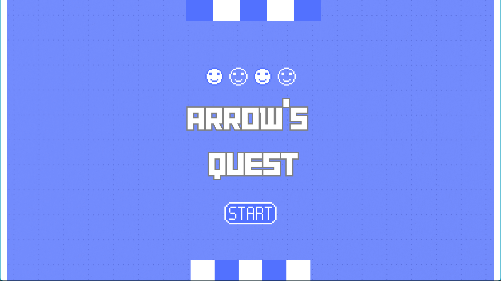
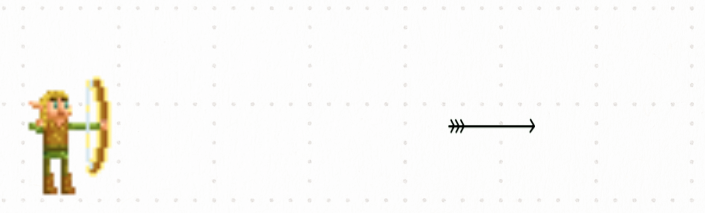
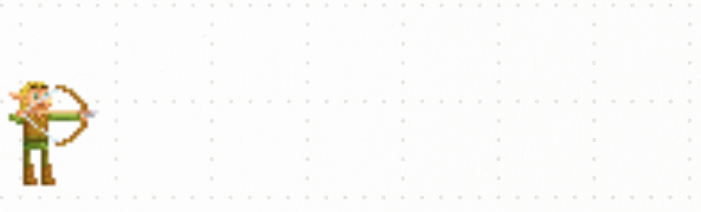

Welcome to Arrows's Quest! In this game, players step into the shoes of a skilled archer with one simple objective: pop as many balloons as possible. With precise aim and timing, players will unleash arrows to burst balloons that drift across the screen. But beware, as the challenge ramps up with faster balloon speeds.
# # 
# **Table of Content:**  
1-How to Play  
2-Game Features      
3-Game Design (Class Hierarchy)   
4-Challenges of Development  
5-UML Diagram   
6-Credits
# #
# How to Play 
A-LEFT Click : To shoot arrows.   
    
B-RIGHT Click : To reload arrows.
    
C-Mouse Movement : To move the Character.  
Use these Controls to shoot arrows while trying to adjust your timing to pop all the balloons with the least amount of arrows to gain the highest score.
# #
# Game Features 
**Level 1 :**   
20 Arrows.  
15 Red Balloons Aligned next to each other moving with constant speed.  
**Level 2 :**  
20 Arrow.  
15 Random Balloon including 3 yellow balloons moving with irregular speed and acceleration.  
 **Win / Lose :**  
 Win : When player succeed in popping 15 balloons without running out of arrows after winning level 1 & 2 you will have level 1 & 2 Score and the total score.  
 Lose : When player run out of arrows before popping all of the balloons offering the player to retry the game.
 **Instruction Menu :**  
  It displays how to play the game and how to win.
# #
# Game Design
Our game is designed on 3 basis :  
**1-Character :** Consists of 2 positions : Neutral position and Ready position. And moves veritcally with the mouse movement. 
```java
 void loadChar() {
  if (mouseY>206) {
    if (showCharImage) {
      image(archerNeutral, 90, mouseY);
    } else {
      image(archerShoot, 90, mouseY);
    }
  } else {
    if (showCharImage) {
      image(archerNeutral, 90, 206);
    } else {
      image(archerShoot, 90, 206);
    }
  }
}
```
**2-Balloons :** Three Classes one parent class which is balloon includes update & show functions of balloons and 2 subclasses redBalloon and yellowBallon. Where level 1 has only red balloons and level 2 has random placed red & yellow balloons.
```java

for (int i=0; i<15; i++) {
    RballoonList.add(new redBalloon(posRBalloon));
    posRBalloon+=60;
  }
  boolean[] usedIndices = new boolean[15];
  int[] rand = new int[15];

  for (int i = 0; i < rand.length; i++) {
    int x;
    do {
      x = random.nextInt(15);
    } while (usedIndices[x]);
    usedIndices[x] = true;
    rand[i] = posYBalloon + x * 60;
  }
  for (int i=0; i<12; i++) {
   YballoonList.add(new redBalloon(rand[i], random(1080, 1400)));
  }
  for (int i=12; i<15; i++) {
   YballoonList.add(new yellowBalloon(rand[i], random(1080, 1400)));
  }
```
**3-Arrows :** Class Arrows has 2 main  functions which are responsible for rendering and moving the arrow and 2 functions for hitting a balloon and for detecting that the arrow is out of screen. And arrows are stored in an arraylist.
```java
void render() {
 
 image(Arrows,x1,y1,width/22,height/8);
 
 }
 
 void move() {
 
 x1 += speed;
 
 }
 
 boolean hit ( balloon b1){
 float distance = dist(x1,y1,b1.x,b1.y);
 return distance < 55 ;
}
boolean outscreen(){
return x1-35>width;
}

```
# #
# Challenges of Development   
1-Randomizing the order of balloons in level 2 and how to store inside 1 arraylist two data types which are redBalloons and yellowBalloons.  
2-Implementing the reload mechanism of arrows.  
3-Balloon popping upon contact with the arrow.
# #
# UML Diagram


# Credits
**Sound Effects :**  
[Sound Effect from Pixabay]: Arrow shooting & Reload sound effect.  
**Music :** 
[audiohero]: Background music track.  
**Software and Libraries:**  
Processing: Development platform.

